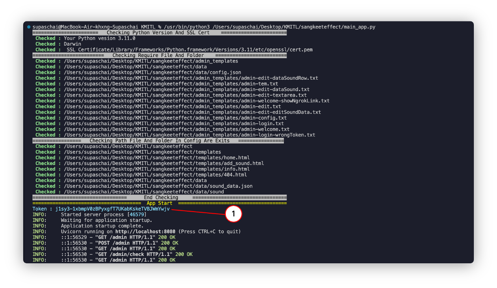
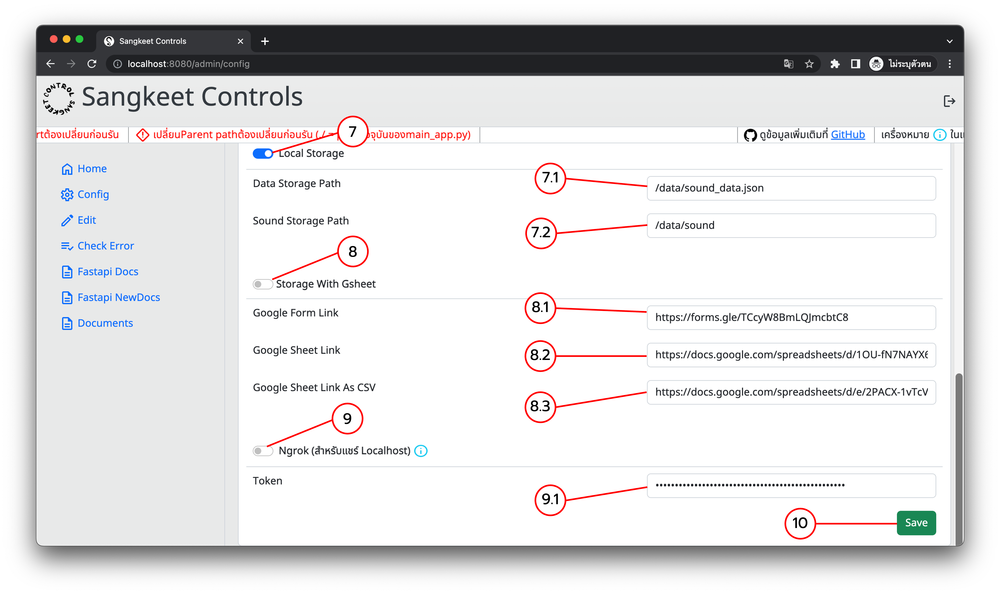
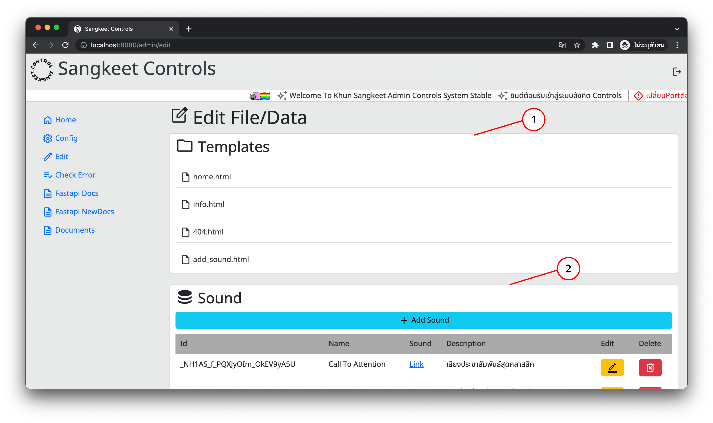
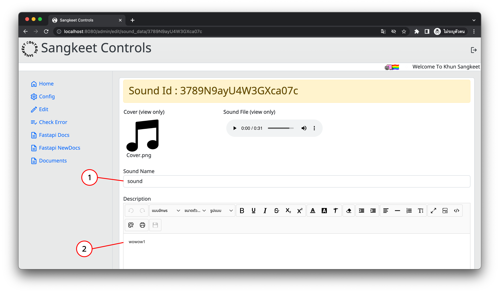
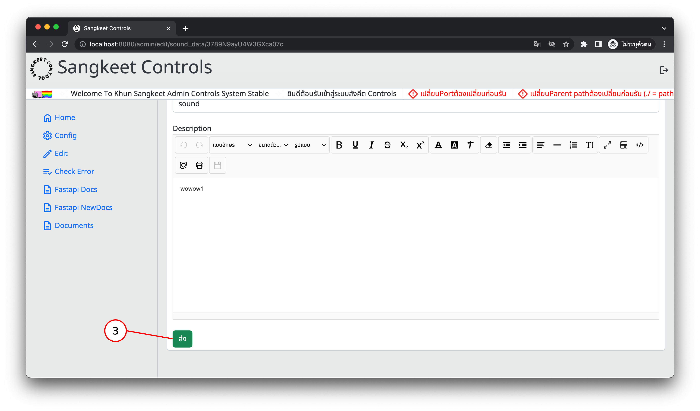
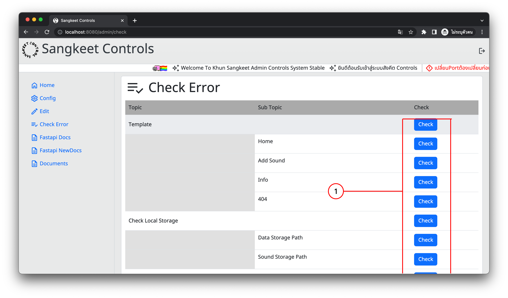
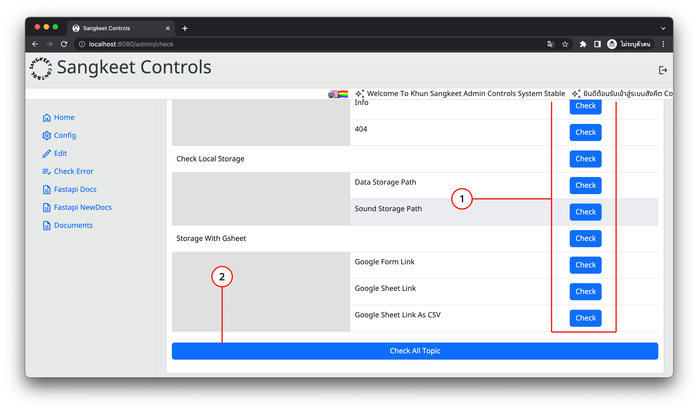
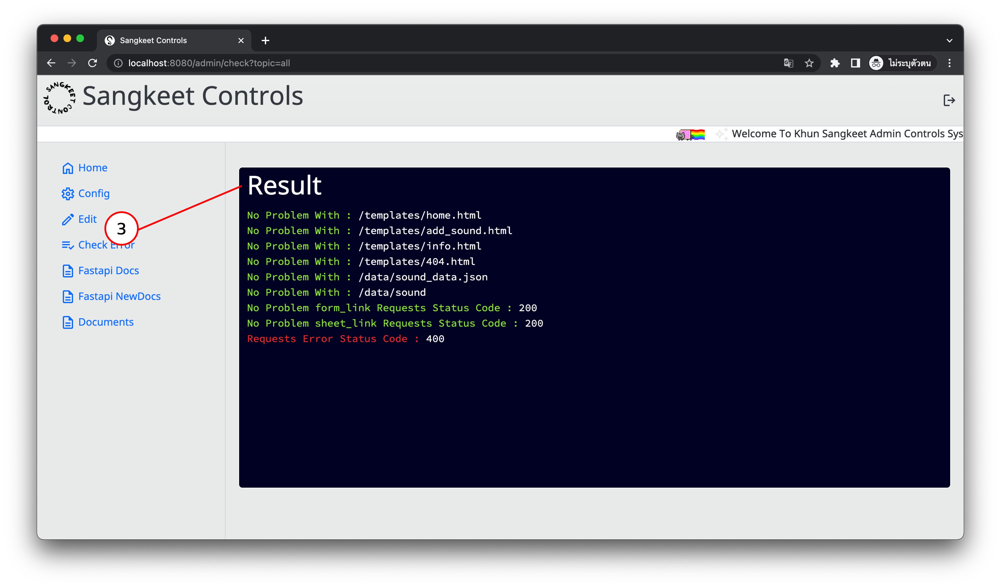

# ส่วนผู้ดูแล
## การรับ Token สำหรับเข้าสู่ระบบ

สามารถรับได้จากเทอมินอล โดยสังเกตุได้ทีตัวอักขระสีฟ้าในเทอมินอล`(1)`

## การ Login

นำโทเค็นที่ได้จากเทอมินอลมาใส่ในช่องโทเค็น`(1) `จากนั้นกดที่ปุ่มล็อกอิน`(2)`เพื่อเข้าสู่ระบบ

เมื่อกดเข้าสู่ระบบแล้วจะมีPopUp Captchaขึ้นให้กดยืนยัน`(3)` จากนั้นกดที่ปุ่มOk`(4)`

## การ Logout

เมื่อต้องการออกจากระบบให้กดไอคอนล็อกเอาท์มุมบนขวามือ`(1)`เมื่อทำการกดแล้ว ระบบจะออกจากระบบควบคุม

หากจะใช้เครื่องมือในส่วนควบคุมจะต้องล็อกอินใหม่อีกครั้ง

## หน้าHome

เมื่อเข้าสู่ระบบสำเร็จแล้วจะเข้ามาสู่หน้าHomeของส่วนควบโดยจะมีSide Bar`(1)`สำหรับลิงค์ไปยังเครื่องมือต่างๆของส่วนควบคุม

เมื่อเลื่อนลงจะพบกล่องสำหรับแสดงหัวข้อของเครื่องมือต่างๆที่มีของส่วนควบคุม`(2)`และกล่องแสดงบัญชีGithub ของผู้จัดทำ`(3)`

## การตั้งค่า Config

ในการตั้งค่าConfigสามารถทำได้ในหน้าConfigโดยหน้านี้จะแสดงPortที่ใช้รันWebApp`(1)`และParent Path(Path แม่ของ Templates[Home, Add_Sound, Info, 404 Error], Data Storage Path[เป็นไฟล์Json] และ Sound Stroage Path[โฟรเดอร์สำหรับเก็บไฟล์เสียง])`(2)`ซึ่งจะไม่สามารถเปลี่ยนได้ในหน้านี้

**หมายเหตุ การใช้`./`หมายถึง Path ปัจจุบันของ Folder เว็บแอป

ผู้ดูแลสามารถเลือกไฟล์ที่จะแสดงเป็นหน้าHomeของส่วนผู้ใช้ได้โดยกรอกชื่อไฟล์ในช่อง**Home**`(3)`, เลือกไฟล์ที่จะแสดงเป็นหน้าเพิ่มเสียงได้โดยกรอกชื่อไฟล์ในช่อง**Add Sound**`(4)`, เลือกไฟล์ที่จะแสดงเป็นหน้าแสดงรายละเอียดเสียงได้โดยกรอกชื่อไฟล์ในช่อง**Info**`(5)` และ หน้าหาไฟล์ในพบ404 Error ได้ที่ช่อง **404**`(6)`

**หมายเหตุชื่อไฟล์ที่จะใส่ทั้งหมดจะต้องอยู่ในโฟรเดอร์`Templates`เท่านั้น

#### การใช้งานโหมดต่างๆในConfig

ผู้ดุแลลสามารถเลือกโหมดการเก็บข้อมูลได้ว่าจะต้องการเก็บข้อมูลแบบ **Local Storage**(เก็บข้อมูลภายในเครื่อง)`(7)` หรือ แบบ **Storage With GSheet**(จะใช้Google Fromรับข้อมูลและใช้Google Sheetในการเก็บข้อมูล)`(8)`

**หมายเหตุโหมดการเก็บข้อมูลสามารถเลือกได้ที่ละโหมด

***หากเปิด `(7)` ต้องใส่ข้อมูล ใน `(7.1)`-`(7.2)`ให้ครบ

***หากเปิด `(8)` ต้องใส่ข้อมูล ใน `(8.1)`-`(8.3)`ให้ครบ

หากต้องการแชร์Local hostให้เป็นPublicให้เปิดฟังก์ชั่นNgrok`(9)` และต้องใส่Ngrok Tokenในช่อง`(9.1)`จึงจะทำงานได้

เมื่อตั้งค่า/เลือกโหมดต่างๆเสร็จแล้วให้ทำการกดSave`(10)`

## การแก้ไขTemplate และ ข้อมูลเสียง

หากต้องแก้ไขไฟล์Templateให้คลิกเลือกไฟล์ที่ต้องการแก้ไขภายในกล่องTemplates`(1)`
ถ้าต้องการแก้ข้อมูลให้ดูที่Box Sound`(2)`แล้วกดที่ปุ่มไอคอนปากกาสีเหลืองบรรทัดเดียวกับข้อมูลเสียงที่ต้องการจะแก้
#### การแก้ไขTemplate
เมื่อคลิกเลือกไฟล์ที่ต้องกาารแก้ไขแล้วจะถูกพามาที่หน้าแก้ไขTemplate

จากนั้นจะสามารถแก้ไขTemplateได้ในText Area`(1)`

เมื่อแก้ไขเสร็จแล้วให้บันทึกโดยการกดปุ่มsave as templates file`(2)`

#### การแก้ไข ข้อมูลเสียง

เมื่อคลิกปุ่มแก้ไขข้อมูลเสียงที่ต้องกาารแก้ไขแล้วจะถูกพามาที่หน้าแก้ไขข้อมูลเสียง
จะสามารถแก้ไข ชื่อของเสียงที่ช่องSound Name`(1)`
และคำอธิบายของเสียงได้ที่ช่องDescription`(2)`

เมื่อแก้ไขเสร็จแล้วให้กดปุ่มส่ง`(3)`เพื่อบันทึกข้อมูลที่แก้เข้าไปใหม่

## การตรวจหาปัญหา

การตรวจปัญหาทำได้โดยการกดปุ่มCheckโดยจะตรวจสอบเฉพาะสิ่งที่สนในโดยใช้ปุ่มCheckที่อยู่Columnท้ายสุด`(1)` หรือตรวจสอบทุกหัวข้อที่มีก็ำด้โดยใช้ปุ่มCheck All Topic`(2)`ก็ได้

เมื่อกดตรวจสอบแล้วผลการตรวจจะอยู่ในResult Box`(3)`บริเวณด้านล่างCheck Error Box
